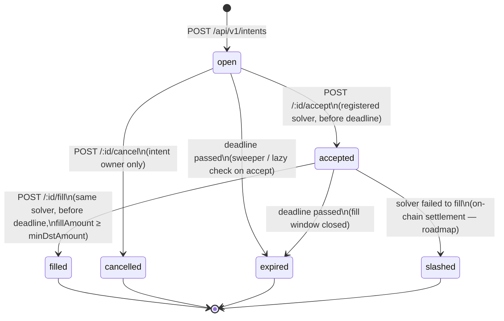

# vortex-backend

**Intent relay API + WebSocket feed for [Vortex Protocol](https://github.com/vortex-protocol).**

[](https://github.com/vortex-protocol/vortex-backend/actions/workflows/ci.yml)
[](./LICENSE)

TypeScript / [NestJS](https://nestjs.com) service that brokers swap intents
between users and the solver network and streams the live intent feed. Part
of the multi-repo Vortex stack — see also
[`vortex-contract`](https://github.com/vortex-protocol/vortex-contract) and
[`vortex-frontend`](https://github.com/vortex-protocol/vortex-frontend).

> The relay currently uses an in-memory store and mock data. Read-only
> Soroban RPC access is live (`/api/v1/chain/*`); writing intent state
> on-chain is still on the roadmap.

> **Rebuild complete:** the service has been ported from Express to NestJS.
> All endpoints below are live.

---

## API Endpoints

```
GET  /api/v1/intents              — list intents (filter by state, user, chain)
GET  /api/v1/intents/open         — all open intents (solver view)
GET  /api/v1/intents/:id          — single intent
GET  /api/v1/intents/user/:addr   — intents for a user
POST /api/v1/intents              — create intent
POST /api/v1/intents/:id/accept   — solver accepts
POST /api/v1/intents/:id/fill     — solver fills
POST /api/v1/intents/:id/cancel   — user cancels
POST /api/v1/intents/quote        — get best quote from solvers
GET  /api/v1/solvers              — solver leaderboard
GET  /api/v1/solvers/:addr/stats  — solver performance stats
GET  /api/v1/tokens               — supported tokens (filter by chain)
GET  /api/v1/stats                — protocol stats
GET  /health                      — service health
WS   /ws                          — real-time intent feed
GET  /docs                        — Swagger / OpenAPI docs
GET  /api/v1/chain/health         — Soroban RPC health (read-only)
GET  /api/v1/chain/ledger         — latest Soroban ledger
GET  /api/v1/chain/network        — Soroban network info
GET  /api/v1/chain/account/:key   — Stellar account lookup
```

---

## Local Development

### Prerequisites

- Node.js 20+

```bash
npm install
cp .env.example .env
npm run dev    # http://localhost:4000
```

### Signing key

`SOROBAN_SIGNING_KEY` holds the secret key the backend uses to submit its own
on-chain writes (settlement, slashing). It's optional in development/test —
leave it blank and those code paths simply have nothing to sign with — but
**required and format-validated in production** (`NODE_ENV=production`); the
process refuses to start without a well-formed Stellar secret seed rather
than falling back to any placeholder.

For local dev, generate a throwaway **testnet-only** keypair — never reuse a
mainnet or otherwise real key:

```bash
npx @stellar/stellar-cli keys generate local-dev --network testnet
npx @stellar/stellar-cli keys show local-dev        # paste into SOROBAN_SIGNING_KEY

# or, ad hoc:
node -e "console.log(require('@stellar/stellar-sdk').Keypair.random().secret())"

# fund it via Friendbot before using it against testnet:
curl "https://friendbot.stellar.org/?addr=<PUBLIC_KEY>"
```

Never commit a filled-in `.env`, and never point a real/funded key at
anything but `mainnet` with `NODE_ENV=production` behind a proper secrets
manager.

### Scripts

| Script | Description |
|---|---|
| `npm run dev` | Watch-mode Nest server (`nest start --watch`) |
| `npm run build` | Build the Nest app (`dist/`) |
| `npm run start` | Run compiled server (`dist/main.js`) |
| `npm run lint` | ESLint over `src` |
| `npm run typecheck` | `tsc --noEmit` |
| `npm run test` | Run the unit test suite |
| `npm run test:e2e` | Run the e2e test suite (supertest against a real booted app) |
| `npm run solver:demo` | Run the reference solver bot ([`scripts/README.md`](./scripts/README.md)) |

---

## Docker

### Full local stack (backend + Postgres)

```bash
docker compose up --build   # first run / after source changes
docker compose up           # subsequent runs
docker compose down -v      # tear down and remove volumes
```

`docker-compose.yml` starts PostgreSQL 16 and the backend together. The
backend is reachable at `http://localhost:4000`; Swagger at `/docs`.

### Database only (for `npm run dev` on the host)

```bash
docker compose up postgres
# then in another terminal:
npm install && cp .env.example .env && npm run dev
```

### Backend image only

```bash
docker build -t vortex-backend .
docker run -p 4000:4000 vortex-backend
```

No `.env` is required to boot — `ConfigModule`'s validation schema supplies
defaults for every variable. Pass real values with `--env-file .env` or `-e`
flags to override them.

---

## Roadmap

- [x] **Soroban RPC reads** — health/ledger/network/account lookups via `/api/v1/chain/*`
- [ ] **On-chain writes** — replace the in-memory intent store with real Soroban transactions (target design: [`docs/architecture/onchain-settlement.md`](./docs/architecture/onchain-settlement.md))
- [x] **Solver WS client** — reference implementation for a solver bot (`npm run solver:demo`, see [`scripts/README.md`](./scripts/README.md))

---

## Intent State Machine

An intent moves through the following states. Transitions are enforced by
`IntentsController` and the background expiry sweeper.



### Transition rules

| From       | To          | Trigger                                                           | Guard                                              |
|------------|-------------|-------------------------------------------------------------------|----------------------------------------------------|
| —          | `open`      | `POST /api/v1/intents`                                           | Valid payload, rate limit not exceeded             |
| `open`     | `accepted`  | `POST /api/v1/intents/:id/accept`                                | Solver registered & active, has bond, before deadline |
| `open`     | `cancelled` | `POST /api/v1/intents/:id/cancel`                                | Caller is the intent owner (verified by signature) |
| `open`     | `expired`   | Sweeper tick or lazy check on `accept`                           | `deadline ≤ now`                                   |
| `accepted` | `filled`    | `POST /api/v1/intents/:id/fill`                                  | Same solver, `fillAmount ≥ minDstAmount`, before deadline, valid signature |
| `accepted` | `expired`   | Sweeper tick or lazy check on `fill`                             | `deadline ≤ now`                                   |
| `accepted` | `slashed`   | On-chain settlement contract                                     | Solver failed to fill within window _(roadmap)_    |

Terminal states (`filled`, `cancelled`, `expired`, `slashed`) are immutable —
no further transitions are possible once an intent reaches one.

---

## Contributing

See the org-wide
[CONTRIBUTING.md](https://github.com/vortex-protocol/.github/blob/main/CONTRIBUTING.md).

## License

[MIT](./LICENSE) © 2025 Vortex Protocol Contributors
