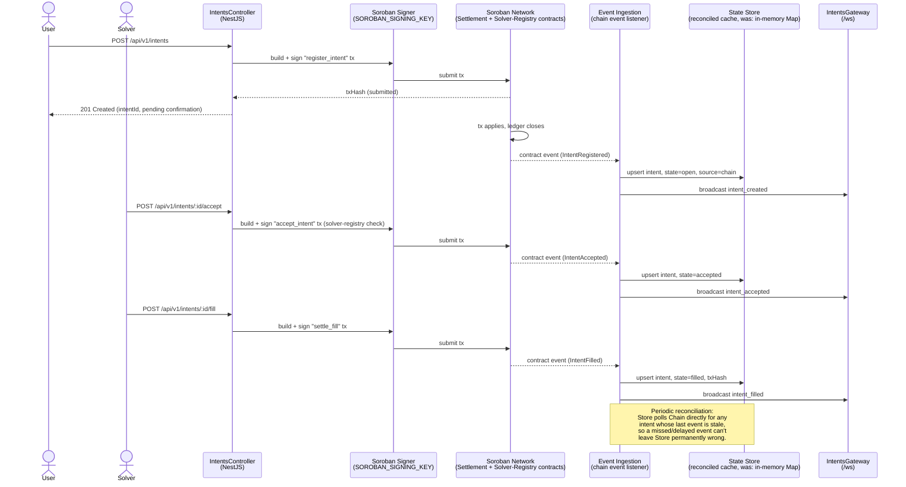

# Architecture: On-Chain Settlement (Target Design)

> **Status: target architecture, not yet implemented.** As of this writing,
> `IntentsService` and `SolversService` are in-memory `Map`s
> (`src/intents/intents.service.ts`, `src/solvers/solvers.service.ts`), and
> `SorobanService` (`src/soroban/soroban.service.ts`) only performs
> read-only RPC calls (`/api/v1/chain/*`). No intent, fill, or slash is
> ever written to a Soroban contract today. This document describes the
> data flow the system moves to once on-chain writes ship — it is a design
> reference for that work, not a description of current behavior. The
> README roadmap checkbox for "On-chain writes" stays unchecked until the
> implementation below actually lands.
>
> The formal decision record for this design — custody model, which
> contract calls map to which `IntentState` transitions, replay protection
> — belongs in an ADR at `docs/adr/0001-onchain-settlement.md` (tracked as
> issue #19, not yet written). Where this document makes a call ahead of
> that ADR (see [Custody model](#custody-model-assumption-pending-adr)
> below), treat it as a proposal for that ADR to confirm or override, not
> as settled fact.

## Why

The in-memory store means every restart loses all intent and solver state,
and there's no way for a user or solver to verify the relay isn't lying
about an intent's status — the API's response is the only record. Moving
the source of truth on-chain (Soroban settlement + solver-registry
contracts) makes intent state independently verifiable and durable across
restarts/deploys.

## Data flow

Four stages, each with a distinct failure mode to design against:

1. **HTTP request → Soroban tx.** `IntentsController` (or whatever replaces
   its current in-memory-only logic) builds the relevant contract
   invocation instead of mutating a `Map` directly, and hands it to a
   signer. The HTTP response returns as soon as the transaction is
   *submitted*, not confirmed — Soroban confirmation isn't synchronous with
   the HTTP request/response cycle, so the response must communicate
   "pending" rather than a final state. This is the same asynchrony
   `scripts/solver-bot.ts` already deals with on the read side; the write
   side needs an equivalent submitted-vs-confirmed distinction.
2. **Soroban tx → event ingestion.** A separate listener (extends
   `SorobanService` or a new module) subscribes to ledger/contract events
   rather than the request handler polling for its own transaction's
   result inline — this decouples "did my request's tx confirm" from "what
   is the current state of this intent," which matters because *other*
   parties' transactions (a solver's `accept`, a sweeper-triggered slash)
   also mutate intent state and need to flow through the same path.
3. **Event ingestion → state reconciliation.** Ingested events update the
   state store (`Store` above) — replacing today's in-memory `Map`, either
   as a full replacement or, more conservatively, the `Map` demoted to a
   read cache kept in sync by this stage. Reconciliation additionally
   *polls* the chain directly for any intent whose last known update is
   older than expected, so a dropped or delayed event doesn't leave the
   cache permanently stale — the chain, not the event stream, is the
   ultimate source of truth. This poll-based backstop is also what
   `docs/runbooks/onchain-cutover.md`'s rollback procedure relies on to
   reconstruct in-memory state from the chain during a rollback.
4. **State store → clients.** `IntentsGateway`'s WebSocket broadcast and
   the REST read endpoints (`GET /api/v1/intents`, etc.) continue to serve
   from the state store exactly as they do today — this layer is
   unaffected by the cutover except that the store's writes now originate
   from ingested chain events instead of directly from controller methods.

## `IntentState` → contract call mapping

| `IntentState` transition | Trigger | Contract call |
|---|---|---|
| *(none)* → `open` | `POST /api/v1/intents` | Settlement contract: register intent |
| `open` → `accepted` | `POST /api/v1/intents/:id/accept` | Solver-registry contract: verify bond/active, then settlement contract: record acceptance |
| `accepted` → `filled` | `POST /api/v1/intents/:id/fill` | Settlement contract: settle fill, verify `fillAmount >= minDstAmount` |
| `open` → `cancelled` | `POST /api/v1/intents/:id/cancel` | Settlement contract: cancel (must verify caller is the original `user`) |
| `open` → `expired` | `IntentsSweeperService` sweep, deadline passed | Settlement contract: mark expired (no penalty — solver never accepted) |
| `accepted` → `slashed` | `IntentsSweeperService` sweep, accepted intent's fill-window deadline passed | Solver-registry contract: penalize solver's bond |

This table is the concrete artifact the ADR (issue #19) needs to ratify —
in particular, whether `expired` needs an on-chain call at all (arguably
it's a pure absence of action and doesn't need a transaction), and whether
`cancel`/`accept` authorization is checked in the contract, the backend, or
both.

## Custody model (assumption, pending ADR)

This document assumes a **backend hot-wallet signer**: the backend holds
`SOROBAN_SIGNING_KEY` and submits transactions on behalf of users and
solvers, rather than relaying pre-signed transactions that users/solvers
sign client-side. This matches how the signing-key config work
(`src/config/env.validation.ts`, `src/config/configuration.ts`) was built —
a single backend-held key, not a per-request user signature. It has an
obvious trust tradeoff (the backend can construct any transaction it wants
against the contracts it holds authority over) that the ADR needs to
either accept explicitly or override in favor of user-signed/relayed
transactions.

## Error handling and asynchrony

- **Submission failure** (bad sequence number, insufficient fee, RPC
  timeout): surfaced to the caller as a 5xx with retry guidance, no state
  store mutation happens.
- **Submitted but not yet confirmed**: the intent enters a `pending`-style
  state (either a new value or reusing existing states with an internal
  "unconfirmed" flag the ADR needs to decide) rather than an optimistic
  update to `open`/`accepted`/`filled` before the chain agrees.
- **Confirmed on-chain but the event listener misses/delays the event**:
  covered by the reconciliation poll in stage 3 above — never a permanent
  inconsistency, only a bounded staleness window.
- **Reorg / transaction fails after appearing to succeed**: Soroban/Stellar
  finality characteristics need to inform how long the reconciliation
  layer waits before treating an event as final; out of scope for this
  document, but must be resolved by the ADR before stage 2/3 above ship.

## Relationship to other in-flight design work

- [`docs/runbooks/onchain-cutover.md`](../runbooks/onchain-cutover.md) —
  the operational procedure for actually flipping a live environment onto
  this architecture, including the dry-run staging and rollback path.
- Issue #35 (dry-run mode) — the flag that lets stages 1–2 above run in
  simulate-only mode during rollout.
- Issue #62 (audit trail) — an independent transition log that's separate
  from, and cross-checked against, the event-sourced state store described
  in stage 3.
- Issue #33 (solver slashing) — the first concrete on-chain write this
  repo implements, ahead of full intent registration/fill; it exercises
  the solver-registry contract call described in the state-mapping table
  above on a narrower surface (sweeper-triggered only, no user-facing HTTP
  write path).

## Persistence layer

Both `IntentsService` and `SolversService` delegate all storage to an
injected repository following the same pattern:

- **`IIntentsRepository`** (`src/intents/intents.repository.ts`) — interface
  backed by a DI Symbol token `INTENTS_REPOSITORY`.
- **`ISolversRepository`** (`src/solvers/solvers.repository.ts`) — interface
  backed by a DI Symbol token `SOLVERS_REPOSITORY`.

Two concrete adapters ship for each:

| Adapter | Module constant | When to use |
|---|---|---|
| `InMemoryIntentsRepository` | `INTENTS_PERSISTENCE=memory` (default) | Development, tests — no database required |
| `PrismaIntentsRepository` | `INTENTS_PERSISTENCE=prisma` | Production / staging — persists to the `intents` table |
| `InMemorySolversRepository` | `SOLVERS_PERSISTENCE=memory` (default) | Development, tests |
| `PrismaSolversRepository` | `SOLVERS_PERSISTENCE=prisma` | Production / staging — persists to the `solvers` table |

### Atomic race-condition protection

`acceptIfOpen` and `fillIfAccepted` are the two operations that must be
race-safe.  Each adapter implements them differently but provides the same
guarantee:

- **In-memory adapter** — the Node.js event loop is single-threaded, so a
  plain state-guard read-then-write is atomic within a single process.
- **Prisma adapter** — uses a single `prisma.intent.updateMany({
  where: { intentId, state: 'open' }, data: ... })` call; the database
  enforces the condition atomically.  A `count === 0` result means another
  writer won the race.  This guarantee holds across multiple horizontally
  scaled API instances.

The `fillIfAccepted` path additionally guards on `solver === <address>` in
the WHERE clause so a different solver can never accidentally fill another
solver's accepted intent.

### Switching adapters

Set `INTENTS_PERSISTENCE=prisma` and `SOLVERS_PERSISTENCE=prisma` in your
environment (see the Docker production deployment section in `README.md`).
`DATABASE_URL` must point to a running Postgres instance with migrations
applied (`npm run db:migrate:prod`).  No code changes are required —
`IntentsModule` and `SolversModule` read the env var in their `useFactory`
provider and instantiate the appropriate adapter.
